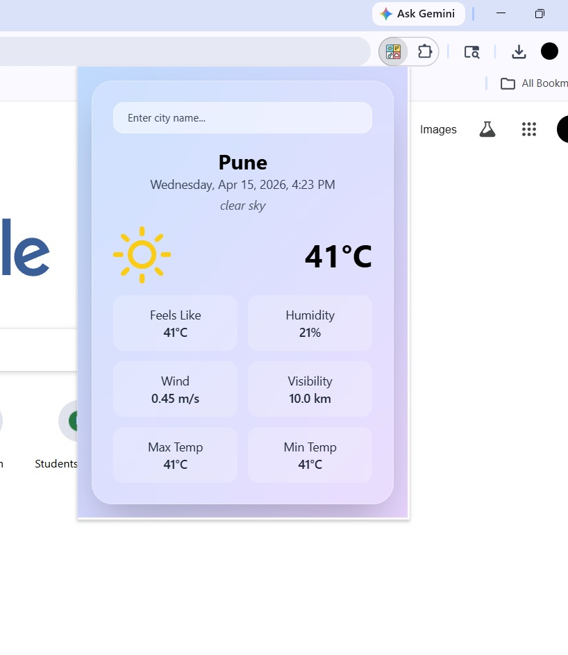

# 🌦️ Glassmorphism Weather Chrome Extension

A sleek and modern Chrome extension that displays real-time weather data using the **OpenWeather API**, wrapped in a beautiful **glassmorphism UI**.



---

## ✨ Features

* 🌍 Get real-time weather updates for any city
* 🎨 Elegant glassmorphism design
* ⚡ Fast and lightweight
* 🌡️ Displays temperature, weather conditions, humidity, and more
* 🔍 Search weather by city name
* 🧊 Smooth UI with blur and transparency effects

---

## 🛠️ Tech Stack

* HTML, CSS, JavaScript
* OpenWeather API
* Chrome Extensions API

---

## 📦 Installation

1. Clone this repository:

   ```bash
   git clone https://github.com/your-username/weather-extension.git
   ```

2. Navigate to the project folder:

   ```bash
   cd weather-extension
   ```

3. Open Chrome and go to:

   ```
   chrome://extensions/
   ```

4. Enable **Developer Mode** (top right corner)

5. Click on **Load unpacked**

6. Select the project folder

---

## 🔑 API Setup

1. Go to [OpenWeather](https://openweathermap.org/api)
2. Sign up and get your API key
3. Replace the API key in your JavaScript file:
in popup.js
   ```js
   const API_KEY = "your_api_key_here";
   ```

---

## 📸 Screenshots

| Weather UI             | Search Feature         |
| ---------------------- | ---------------------- |
|  |  |

---

## 🚀 Usage

* Click on the extension icon
* Enter a city name
* View real-time weather instantly

---

## 📁 Project Structure

```
weather-extension/
│── manifest.json
│── popup.html
│── style.css
│── script.js
│── assets/
```

---

## 🤝 Contributing

Contributions are welcome!

1. Fork the repo
2. Create your feature branch
3. Commit your changes
4. Push to the branch
5. Open a Pull Request

---

## 📝 License

This project is licensed under the MIT License.

---

## 💡 Future Improvements

* 📍 Auto-detect user location
* 🌙 Dark/light mode toggle
* 📊 5-day weather forecast
* 🌐 Multi-language support

---

## 🙌 Acknowledgements

* OpenWeather API for weather data
* Inspiration from modern glass UI trends

---

⭐ If you like this project, give it a star on GitHub!
